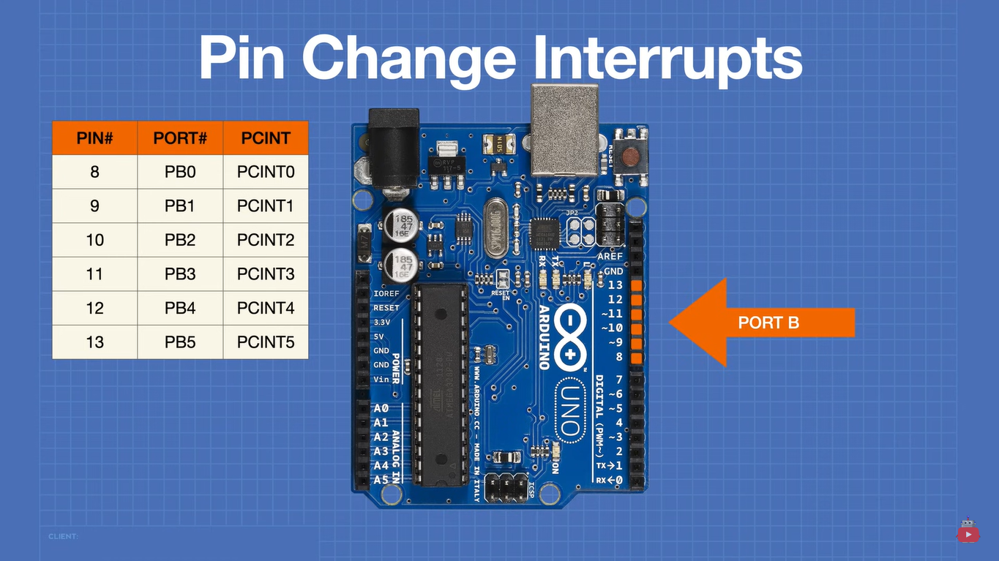
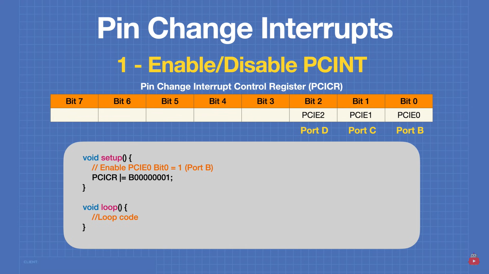
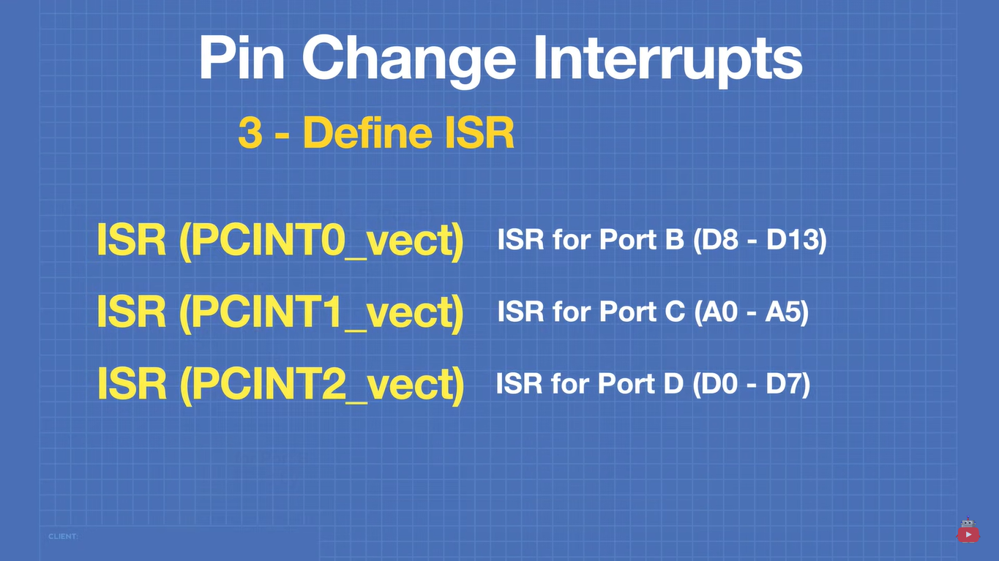
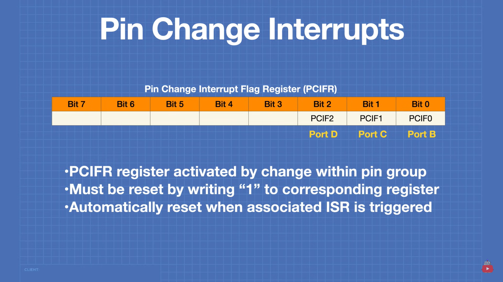

# Interrupt Summary

## Table of contents
- [Hardware Interrupt](#Hardware-Interrupt)
- [None Hardware Interrupt intro](#None-Hardware-Interrupt-intro)
- [None Hardware Interrupt Code](#None-Hardware-Interrupt-Code).
- [Timer Interrupt](#Timer-Interrupt).

## Hardware Interrupt

The only pins that takes interrupt on Arduino UNO is

- Pin 2 → Interrupt 0
- Pin 3 → Interrupt 1

you can attach the interrupt using the following

1- `attachInterrupt(PortNumber, ISR, Mode)`
- Port number: is for the number of prt represent the pin
- ISR: the function that will access when interrupt happens
- Mode: Falling, rising or both edges

2- `digitalPinToInterrupt(PinNO.)`  
to give the exact port based on the pin

#### EX: 
`attachInterrupt(digitalPinToInterrupt(2), light, FALLING);`

## None Hardware Interrupt intro

you can connect another pins to make them a valid interrupt  
note: They won't be normal hardware interrupt. 
### How Non-Hardware Interrupts Work?

A **non-hardware interrupt** works by continuously checking for changes in a pin’s state in software, instead of relying on dedicated interrupt hardware. This is typically done using **polling** or **Pin Change Interrupts (PCI).**

### 1. Polling Method
Polling is when the microcontroller constantly checks the state of a pin inside the `loop()` function. If a change is detected, it executes the corresponding action.

#### How It Works
- The program repeatedly reads the state of a pin.
- If a change is detected, a function is called to handle it.
- This method is slower than hardware interrupts because the program must **constantly check the pin**.

#### Downsides of Polling
- **Inefficient**: The CPU wastes time checking a pin even when it hasn’t changed.
- **Slower Response**: The program may not detect changes instantly, especially if other tasks are running.

### 2. Pin Change Interrupts (PCI)
The **Arduino Uno** has a feature called **Pin Change Interrupts (PCI)** that allows **any digital pin** to trigger an interrupt, but it's handled differently from **hardware interrupts**.

#### How It Works
- Note that it's working on both edges, so when connecting with a button for example you the ISR function will be entered twice, to solve it add an if statment 
- Instead of **dedicated** hardware interrupts for each pin (like pins 2 & 3), PCI uses **interrupt groups**.
- A group of pins (e.g., D0–D7) share a single interrupt **vector**.
- When **any** pin in that group changes, the program must check which one triggered the interrupt.

#### Why PCI is Not a True Hardware Interrupt
- **Slower than dedicated hardware interrupts** (pins 2 & 3).
- **Shared interrupt vector** means multiple pins can trigger the same interrupt, so you must manually check which pin changed.
- Still faster than polling, but **not as instant** as a true hardware interrupt.

### 3. Timer-Based Software Interrupts
If a precise timing-based action is needed, **timers** can be used to periodically check inputs without relying on hardware interrupts.

#### How It Works
- A timer is set up to trigger at specific intervals.
- Inside the timer function, the program checks for changes in the pin state.
- This allows "interrupt-like" behavior without a dedicated hardware interrupt.

## None Hardware Interrupt Code

### Arduino Ports
Arduino has three main ports

#### 1- Port B

#### 2- Port C

#### 3- Port D

### How to enable PCI

#### 1- Enable the **PCI** for the port

#### 2- Enable the **PCI** for the pins

##### Example for Port B

### 3- Define ISR

##### Example for Port B

### 4- Change interrupt flag

---

## Timer Interrupt

#### Arduino UNO has 3 Timers

### Clock:
- **speed:** 16 MHz CLOCK
- **prescaller:** 1, 8, 64, 256, 1024

### Timer1 & Timer0

### Timer2

### Functions:

### 1- TCNT1:
Timer1 Current value (can be used for any time aswell)
A register that stores the current count value of Timer1.
Continuously increments (or decrements in some modes).
Gets reset automatically in CTC mode when it matches OCR1A

### 2- WGM12 (CTC mode):
-  timer mode where the counter resets to 0 when it reaches a compare match value.
-  Enabled by setting WGM12 = 1 in TCCR1B
- will use OCR1A: A register that stores the value at which Timer1 resets in CTC mode.
- EX: OCR1A = 32 * 10 ^ 6
In CTC mode, the timer doesn't actually count to OCR1A in one cycle. Instead, it counts multiple smaller cycles before reaching OCR1A.

### 3- TCCR1A and TCCR1B:
is for the mode, they are too complicated, to simplify just look at 
[timer1 & timer2 section](#Timer1-&-Timer0)

